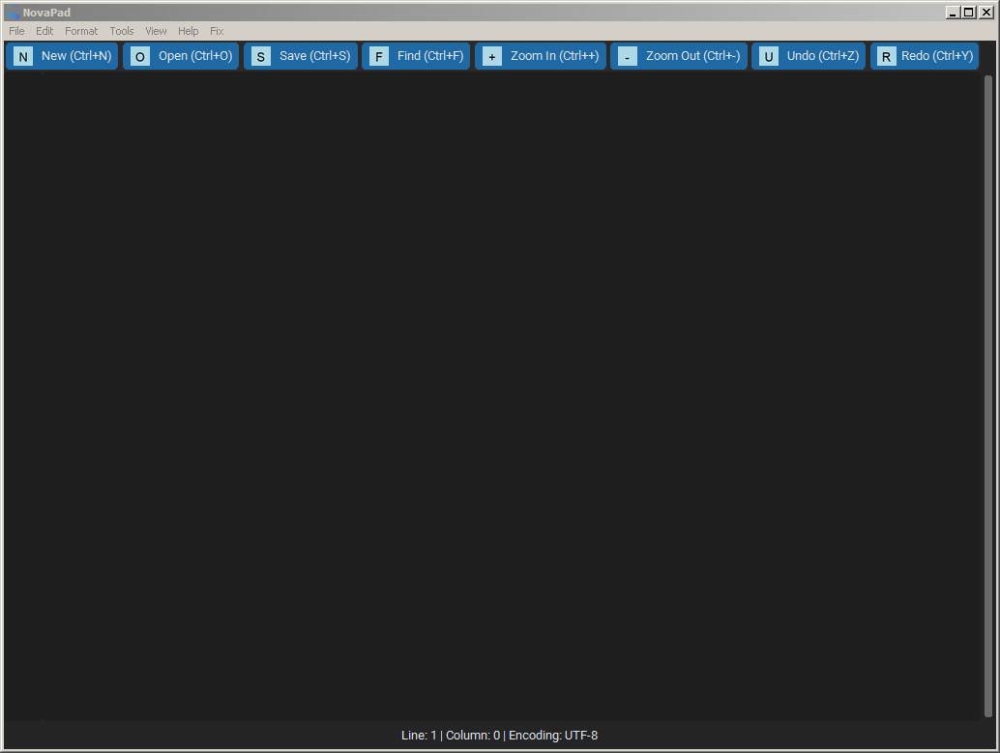

# 🚀 NovaPad - Modern Text Editor `V2.1.0`  

  
*Your new favorite text companion – sleek, fast, and powerful!*  

---

## 🌟 **Why Choose NovaPad?**  

**NovaPad** isn't *just* another text editor – it's a **lightweight powerhouse** designed for speed, simplicity, and joy! Whether you're jotting notes, editing scripts, or tackling massive files, NovaPad delivers a seamless experience.  

✅ **Best-in-Class Performance** | 🎨 **Stylish Themes** | ⚡ **Blazing Fast**  

---

## 🎯 **Features That Shine**  

### 📁 **File Management Made Effortless**  
- **New**/**Open**/**Save**/**Save As** – Work smarter with intuitive file controls.  
- 🚀 **Large File Support** – Open 100MB+ files without breaking a sweat!  

### ✂ **Edit Like a Pro**
- Undo/Redo ∞ times (Never lose progress!)
- Clipboard Magic: **Cut** | **Copy** | **Paste** | **Delete**

### 🔍 **Find & Replace Revolution**  
  
*Instantly locate text or swap phrases globally with our smart tools!*  

> [!tip]  
> Use **Ctrl+F** to quickly open the Find & Replace dialog and streamline your editing workflow!

### 🌗 **Dark Mode Bliss**  
  
*Protect your eyes during late-night coding sessions! Switch between:*  
- **Solar Light**  (Default)
- **Midnight Dark**

> [!note]  
> NovaPad now supports **system theme synchronization**! It automatically adjusts to your OS theme settings for a seamless experience.

---

## 🆕 **What's New in v2.1.0**  
  

- **System Theme Sync**: NovaPad now adapts to your OS theme (Light/Dark).  
- **Enhanced Find & Replace**: Improved performance and usability.  
- **New Icons**: Refreshed UI for a modern look.  
- **Bug Fixes**: Smoother performance and fewer crashes.  

> [!warning]  
> If you're upgrading from a previous version, ensure you back up your settings file (`config.json`) to avoid losing custom configurations.

---

## 🖥️ **Compatibility Matrix**  

| Windows Version | Supported          | Notes                 |
|-----------------|--------------------|-----------------------|
| Windows 7       | ✅ Full Support    |                       |
| Windows 8/8.1   | ✅ Full Support    |                       |
| Windows 10      | ✅ Optimized       | Recommended OS        |
| Windows 11      | ✅ Native Support  | Fluent Design Ready   |

---

## 🛠️ **Installation in 3...2...1...**  

1. Download `Setup.exe` from [Releases](https://github.com/Aymene21/NovaNad/releases)  
2. **Double-click** the installer  
3. Follow the friendly setup wizard 🧙♂️  
4. **Launch** and start creating! 🎉  

> [!tip]  
> For portable use, download the **ZIP version** from the releases page and extract it to your desired location. No installation required!

---

## 🤝 **Meet the Dream Team**  

| Role                 | Contributor         | Achievement                          |
|----------------------|---------------------|--------------------------------------|
| **Lead Developer**   | Aymene Boudali      | Core functionality & architecture    |
| **UI/UX Wizard**     | Meriem Boudali      | Custom theme engine & icons          |
| **Installer Guru**   | Zack Williams       | One-click installer & deployment     |
| **AI Assistant**     | DeepSeek            | Debugging & feature brainstorming    |

---

## 📬 **Let's Stay Connected!**  

📧 **Email**  
boudaliaymene4@gmail.com  

🎥 **YouTube**  
[http://youtube.com/@Technodev156](http://www.youtube.com/@Technodev156) *(Pro tip: Hit that 🔔 for updates!)*  

🎮 **Game Portfolio**  
[https://aymene-boudali.itch.io/](https://aymene-boudali.itch.io/)  

---

> Made with ❤️ by developers, for developers.  
> ✨ **Tip Jar**: If you love NovaPad, star our repo and share with your squad!  
